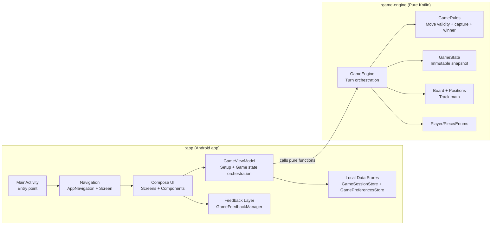
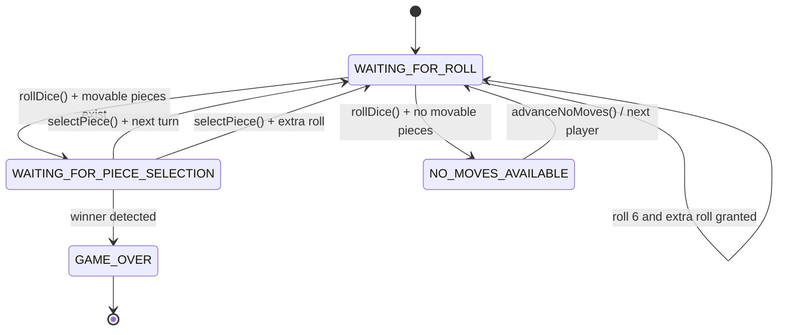
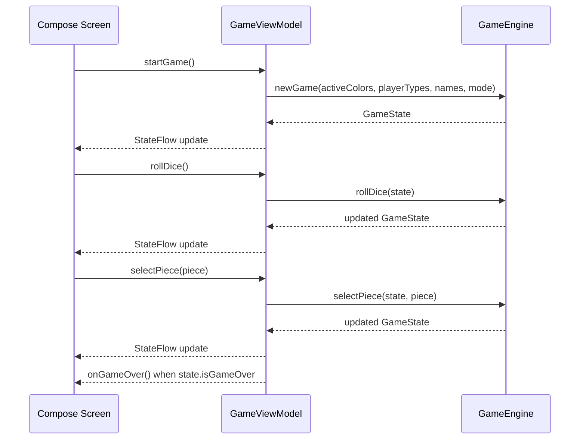

# FailureLudo Architecture Maps

This document is the canonical high-level architecture reference for this repository.

## 1) Repository Module Map



  ## 2) Repository Directory Structure

  ```text
  FailureLudo/
  ├── app/
  │   ├── src/main/
  │   │   ├── kotlin/com/failureludo/
  │   │   │   ├── MainActivity.kt
  │   │   │   ├── ui/
  │   │   │   │   ├── components/
  │   │   │   │   ├── navigation/
  │   │   │   │   ├── screens/
  │   │   │   │   └── theme/
  │   │   │   └── viewmodel/
  │   │   ├── res/
  │   │   └── AndroidManifest.xml
  │   └── build.gradle.kts
  ├── game-engine/
  │   ├── src/main/kotlin/com/failureludo/engine/
  │   └── build.gradle.kts
  ├── docs/
  │   └── architecture-maps.md <-- you are here
  ├── plans/
  │   ├── 001-game-experience-improvement-plan.md
  │   └── 002-offline-game-ui-production-plan.md
  ├── gradle/
  ├── build.gradle.kts
  └── settings.gradle.kts
  ```

  - `app/`: Android application module (UI, navigation, Compose rendering, ViewModel orchestration).
  - `game-engine/`: Pure Kotlin domain module (rules, turns, state transitions, board math).
  - `docs/`: Architecture and engineering reference docs.
  - `plans/`: Numbered implementation and production-readiness trackers.

  ## 3) Runtime Screen/Flow Map

```mermaid
flowchart TD
    HOME[HomeScreen]
    SETUP[GameSetupScreen]
    GAME[GameBoardScreen]
    WIN[WinScreen]

    HOME -->|New Game| SETUP
    HOME -->|Resume (if active game)| GAME
    SETUP -->|Start Game| GAME
    GAME -->|Game over callback| WIN
    GAME -->|Quit| HOME
    WIN -->|Play Again| GAME
    WIN -->|Main Menu| HOME
```

## 4) Turn Lifecycle Map



## 5) App ↔ Engine Interaction Map



## 6) Source Ownership Map

- Android entry and composition root: `app/src/main/kotlin/com/failureludo/MainActivity.kt`
- App navigation graph: `app/src/main/kotlin/com/failureludo/ui/navigation/AppNavigation.kt`
- UI screens:
  - `app/src/main/kotlin/com/failureludo/ui/screens/HomeScreen.kt`
  - `app/src/main/kotlin/com/failureludo/ui/screens/GameSetupScreen.kt`
  - `app/src/main/kotlin/com/failureludo/ui/screens/GameBoardScreen.kt`
  - `app/src/main/kotlin/com/failureludo/ui/screens/WinScreen.kt`
- App orchestration state holder: `app/src/main/kotlin/com/failureludo/viewmodel/GameViewModel.kt`
- Core game domain and rules: `game-engine/src/main/kotlin/com/failureludo/engine/`

## 7) Current Design Constraints

- `:game-engine` is deterministic and immutable-state driven from public APIs.
- `:app` owns UI lifecycle, navigation, animations, and bot turn timing delays.
- `:app` also owns offline persistence (session + preferences) and feedback output (sound/haptics).
- A local persistence layer now stores setup + game session snapshots for offline resume.
- No networking path is currently present; architecture is local/offline-first.
